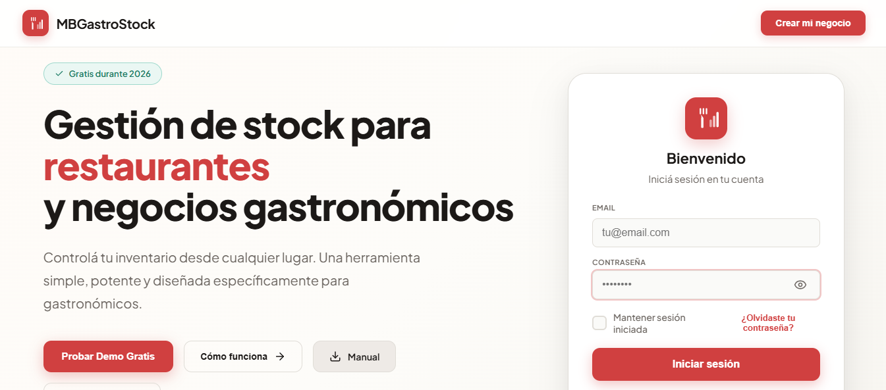
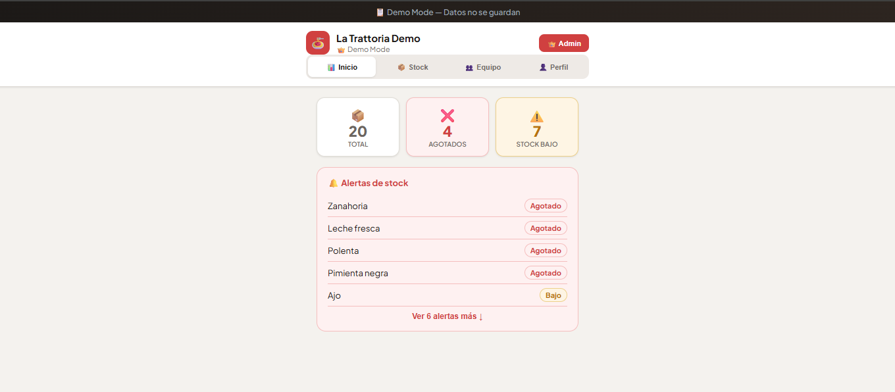
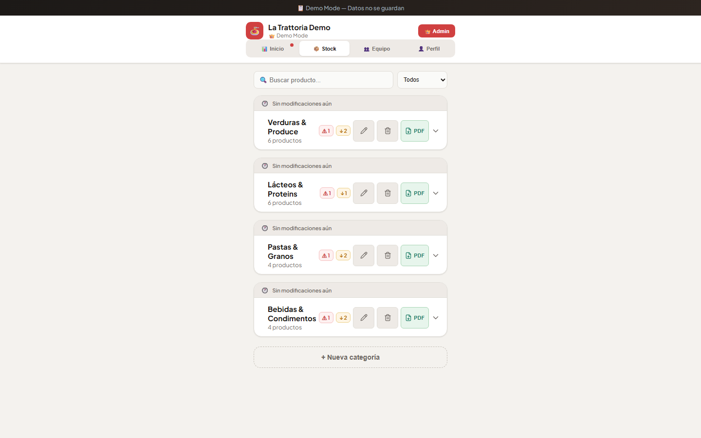
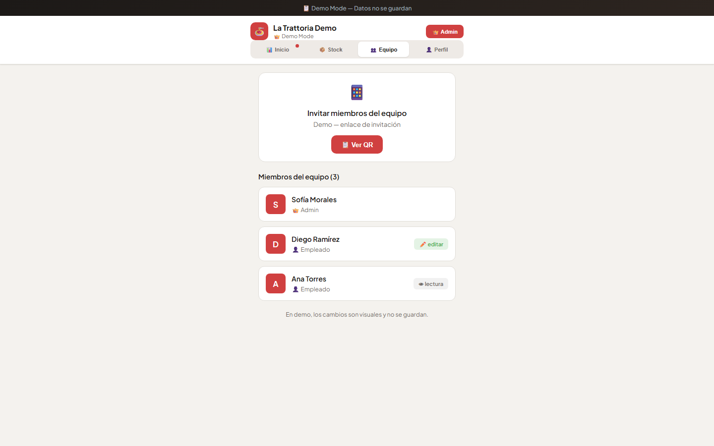
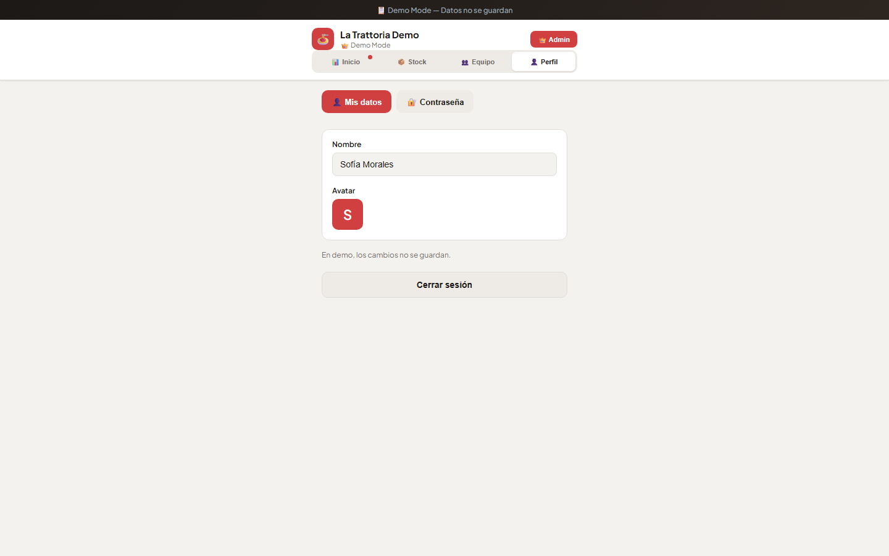

# MBGastroStock

Real-time inventory management for restaurants and food businesses.

**[→ Try the live demo](https://mbgastrostock.vercel.app/?demo=true)** (no signup required)

---

## Overview

A modern web app for restaurant kitchens to track inventory, manage stock levels, and collaborate with teams. Built with React, Supabase, and deployed on Vercel.

---

## Features

- 📊 Real-time inventory dashboard with stock status indicators
- 📱 Mobile app (installable PWA for iOS/Android)
- 👥 Team collaboration with role-based access control
- 🚨 Low stock alerts and notifications
- 📈 Data export to PDF
- 🎯 Interactive guided walkthrough (7 steps)
- 💾 Cloud sync across all devices
- 🔐 Secure authentication with Supabase

---

## Try the Demo

**[→ Open Interactive Demo](https://mbgastrostock.vercel.app/?demo=true)** — No signup required

The demo includes:
- 20 sample products across 4 categories (Vegetables, Dairy, Grains, Beverages)
- 3 demo team members with different roles
- Full walkthrough showing all features
- Real-time inventory with color-coded status (✅ Ok / ⚠️ Low / ❌ Out of Stock)
- Mobile responsive design
- PWA install button on mobile

---

### 🎞️ Capturas de Pantalla

#### Landing Page (Desktop)

*Página inicial con información del app y opción para entrar a la demo*

#### Dashboard (Inventario en Tiempo Real)

*Vista principal con inventario. 🟢 Green = ok, 🟡 Yellow = bajo, 🔴 Red = agotado*

#### Stock Tab (Gestión de Inventario)

*Listado detallado de productos con cantidad actual vs. mínimo requerido*

#### Equipo Tab (Miembros del Equipo)

*Gestión de permisos y roles del equipo con vista de miembros activos*

#### Perfil Tab (Configuración)

*Información de usuario y preferencias de cuenta*

---

## Tech Stack

- **Frontend:** React 18, Vite, Tailwind CSS
- **Backend:** Supabase (PostgreSQL, Auth, Realtime)
- **Deployment:** Vercel
- **Mobile:** PWA with Service Worker

---

## About

A portfolio project demonstrating full-stack web development with modern tools and practices. The complete source code is in a private repository.

👋 **María Brown** — Full-stack developer  
[GitHub](https://github.com/mariabrownlejarraga) | [Email](mailto:mariabrownlejarraga@gmail.com)

---

**[Try the demo →](https://mbgastrostock.vercel.app/?demo=true)**
